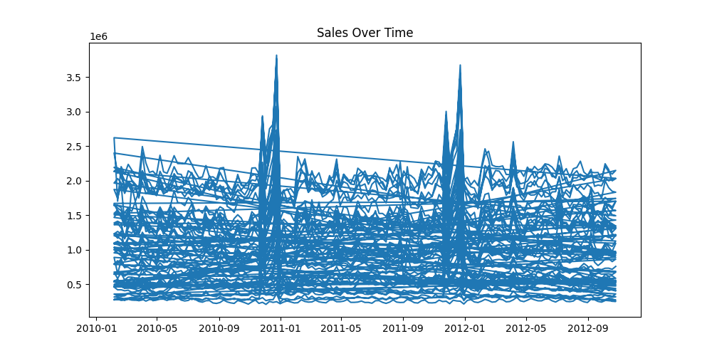
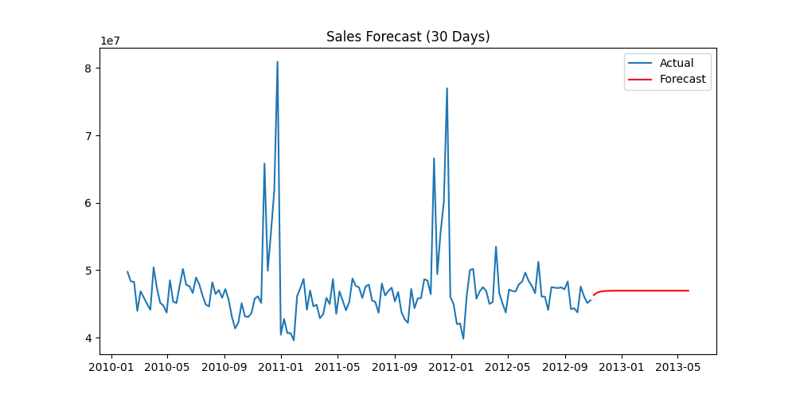
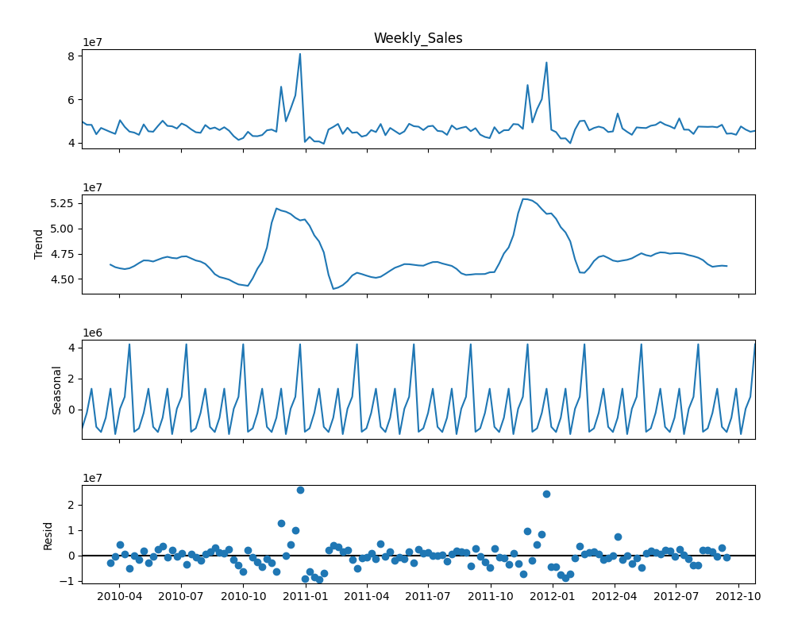

# 📈 Sales Forecasting — Time Series Analysis System

### Data-Driven Demand Prediction & Trend Analysis

[](https://python.org)
[](https://www.statsmodels.org)
[]()
[]()
[](LICENSE)

<br>

> An end-to-end time series forecasting system designed to analyze historical sales data, identify trends and seasonality, and predict future demand using ARIMA — enabling data-driven business planning and decision-making.

---

## 📌 Problem Statement

Retail businesses often struggle with **demand uncertainty**, leading to:

* Overstocking or understocking issues
* Inefficient inventory management
* Revenue loss due to poor demand forecasting

This project addresses these challenges by building a **time-series forecasting pipeline** to model sales behavior and predict future demand.

---

## ✨ Key Features

* 📊 **Time Series Analysis** — Structured sales data into chronological format
* 🔄 **Trend & Seasonality Detection** — Identifies recurring sales patterns
* 🔮 **Forecasting Model** — Predicts future sales using ARIMA
* 📉 **Decomposition Analysis** — Breaks data into trend, seasonal, and residual components
* 📁 **End-to-End Pipeline** — From raw data → cleaned → modeled → forecasted
* 📌 **Business Insights** — Actionable outputs for decision-making

---

## 🛠️ Tech Stack

| Layer                    | Technology          |
| ------------------------ | ------------------- |
| **Language**             | Python 3.11         |
| **Data Processing**      | Pandas, NumPy       |
| **Visualization**        | Matplotlib, Seaborn |
| **Time Series Modeling** | Statsmodels (ARIMA) |
| **Environment**          | Jupyter Notebook    |

---

## 🔄 System Workflow

```
Raw Sales Data
        │
        ▼
Data Cleaning & Preprocessing
(Date Conversion + Aggregation)
        │
        ▼
Time Series Structuring
(Grouped by Date)
        │
        ▼
Trend & Seasonality Analysis
(Decomposition)
        │
        ▼
ARIMA Model Training
        │
        ▼
Sales Forecast (30 Days)
        │
        ▼
Business Insights & Decisions
```

---

## 📊 Forecasting Results

### 📈 Sales Trend

Historical sales trend over time showing overall demand pattern


---

### 🔮 Sales Forecast (30 Days)

Predicted future sales based on historical patterns


---

### 🔍 Time Series Decomposition

Breakdown of trend, seasonality, and residual components


---

## 📊 Key Insights

### 🔹 Trend Analysis

* Sales exhibit a **consistent long-term trend**, indicating stable demand patterns
* Periodic fluctuations suggest external influencing factors such as promotions or events

---

### 🔹 Seasonality Patterns

* Clear **seasonal cycles** observed in sales behavior
* Demand spikes occur during specific recurring intervals

---

### 🔹 Forecasting Insights

* ARIMA model effectively captures **temporal dependencies**
* Provides reliable short-term forecasts for operational planning

---

### 🔹 Business Impact

* Enables **inventory optimization** and demand planning
* Reduces stockouts and overstocking risks
* Supports **data-driven revenue forecasting strategies**

---

## 🚀 Run Locally

### 1. Clone Repository

```bash
git clone https://github.com/thisisdvnsh-thkr/sales-forecasting-analysis.git
cd sales-forecasting-analysis
```

### 2. Install Dependencies

```bash
pip install -r requirements.txt
```

### 3. Run Notebooks

```bash
jupyter notebook
```

---

## 📁 Project Structure

```
sales-forecasting-analysis/
│
├── data/
│   ├── raw/                 # Original dataset
│   └── processed/           # Cleaned data
│
├── notebooks/
│   ├── eda.ipynb            # Trend & analysis
│   └── forecasting.ipynb    # ARIMA modeling
│
├── pipeline/
│   ├── ingestion.py
│   ├── transformation.py
│   └── model.py
│
├── visuals/
│   ├── sales-trend.png
│   ├── forecast.png
│   └── decomposition.png
│
├── requirements.txt
└── README.md
```

---

## 🔮 Future Enhancements

* Implement **SARIMA** for improved seasonal modeling
* Add **Prophet model** for advanced forecasting
* Deploy model using **Streamlit dashboard**
* Integrate real-time data pipelines

---

## 👤 Author

**Devansh Thakur**
Aspiring Data Engineer / AI-ML

🔗 GitHub: https://github.com/thisisdvnsh-thkr
🔗 LinkedIn: https://linkedin.com/in/devansh-thakur

---

<div align="center">

Sales Forecasting System © 2026
Built with Python, Statsmodels & Time Series Analysis

⭐ Star this repo if you found it useful!

</div>
